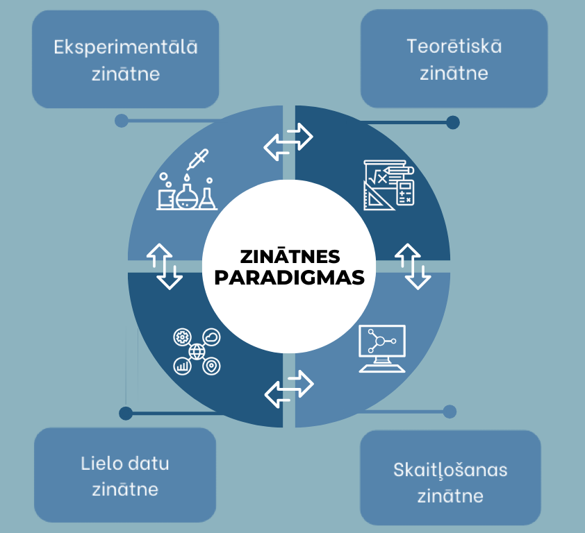

```attention-note {label: "Definīcija atkārtoti"}
**Augstas veiktspējas skaitļošana** jeb **HPC** (*angl. High Performance Computing*) ir spēja apstrādāt lielus datu apjomus un veikt sarežģītus aprēķinus lielā ātrumā.
```

<!-- > _DEFINĪCIJA:_ **Augstas veiktspējas skaitļošana** jeb **HPC** (*angl. High Performance Computing*) ir spēja apstrādāt lielus datu apjomus un veikt sarežģītus aprēķinus lielā ātrumā. -->


<!-- Tip: {label: Ieteikums } use temporary directory -->


<!-- # 1.2.13 Piemērs - Laika Prognozes -->


# Kā HPC ietekmē pasauli

> HPC resursi un zināšanas ir ļoti būtiska vērtība jebkurai mūsdienu sabiedrībai un palīdz nodrošināt konkurences priekšrocības pētniecībā un rūpniecībā.  
Superdatori ir konkurētspējīgākas un spēcīgākas Eiropas ekonomikas sastāvdaļa.

Iesākumā aplūkosim **zinātnes paradigmas** un superdatoru lomu tajās.

Zinātniskajos pētījumos tiek izmantotas vairākas metodes, lai rastu skaidrojumus dabas parādībām un izteiktu prognozes par to uzvedību. 

Divas klasiskas zinātnes metodes ir eksperimentālā un teorētiskā. 

<!-- > [**Eksperimentālās zinātnes**](https://raw.githubusercontent.com/viktorszagorskis/hpc-pamati/main/docs/11.md) pamatā ir novērojumi un mērījumi.  -->

**Eksperimentālās zinātnes** pamatā ir novērojumi un mērījumi. Agrīnā astronomija ir eksperimentālās zinātnes piemērs. Senie astronomi vēroja debesis vispirms ar acīm un pēc tam ar teleskopiem un fiksēja Saules, Mēness, Saules sistēmas planētu un dažu zvaigžņu pozīcijas un kustību. Viņi secināja, ka novērojumi atbilst konkrētiem modeļiem. Līdzīgi mikroskopus var izmantot, lai novērotu nelielu daļiņu nejaušu kustību šķidrumā (Brauna kustība) utt.

Dažādiem eksperimentiem ir nepieciešami atšķirīgi mērīšanas aparāti. Eksperimentu veikšana var būt ļoti dārga vai pat neiespējama. Tomēr eksperimentālo zinātni var uzskatīt par fundamentālo paradigmu: teorijas un datorsimulācijas galu galā tiek apstiprinātas vai noraidītas, pamatojoties uz mērījumiem.

<!-- > [**Teorētiskā zinātne**](https://raw.githubusercontent.com/viktorszagorskis/hpc-pamati/main/docs/12.md) izstrādā modeļus, kurus dažkārt sauc par dabas likumiem, kas atbilst vai "izskaidro" mērījumus un labākajā gadījumā prognozē parādības, kas vēl nav novērotas.  -->

**Teorētiskā zinātne** izstrādā modeļus, kurus dažkārt sauc par dabas likumiem, kas atbilst vai "izskaidro" mērījumus un labākajā gadījumā prognozē parādības, kas vēl nav novērotas. Piemēram, pamatojoties uz novērojumiem, var paredzēt saulrieta laiku konkrētai dienai. Novērojumi arī parāda, ka akmens lidojuma laiks ir aptuveni vienāds neatkarīgi no tā svara, kad tas tiek nomests no viena augstuma. Ņūtona izstrādātie gravitācijas un dinamikas matemātiskie modeļi spēj radīt prognozes ķermeņu kustībai, kas ļoti labi atbilst izmērītajiem rezultātiem.

Novērojumu dati ļauj zinātniekiem tos analizēt un mēģināt tos izskaidrot, aprakstīt ar noteiktām matemātiskām formulām. Parasti vispirms ir 
novērojumi, un tad tiek izstrādāta teorija, lai tos izskaidrotu. Bet ne vienmēr. Piemēram, pirms vairāk nekā 50 gadiem teorētiķi 
Fransuā Englerts (*François Englert*) un Pīters Higss (*Peter Higgs*), lai izskaidrotu masas (matērijas, zvaigžņu, planētu) esamību, 
piedāvāja ieviest jaunu fizikālu lauku, ko tagad sauc par Higsa lauku. 
Pirmo eksperimentālo aptiprinājumu Higsa laukam ieguva tikai 2012. gadā.

<!-- > Kopš 20. gadsimta vidus eksperimentālo un teorētisko zinātni ir papildinājusi [**skaitļošanas zinātne**](https://raw.githubusercontent.com/viktorszagorskis/hpc-pamati/main/docs/13.md) (*computational science*). Skaitļošanas zinātni var definēt kā disciplīnu, kas saistīta ar matemātisko modeļu izstrādi, ieviešanu un izmantošanu, lai analizētu un atrisinātu problēmas, izmantojot datorsimulācijas un skaitlisko analīzi.  -->

Kopš 20. gadsimta vidus eksperimentālo un teorētisko zinātni ir papildinājusi **skaitļošanas zinātne** (*angl. computational science*). Skaitļošanas zinātni var definēt kā disciplīnu, kas saistīta ar matemātisko modeļu izstrādi, ieviešanu un izmantošanu, lai analizētu un atrisinātu problēmas, izmantojot datorsimulācijas un skaitlisko analīzi. 

Ir ierobežojumi tam, ko var izdarīt ar pildspalvu un papīru vai kādus eksperimentus var veikt. 
Piemēram, turpinot astronomisko tēmu, ir pietiekami vienkārši pierakstīt vienādojumus, kas raksturo Saules, Mēness un Zemes kustību. 
Šī ir tā sauktā trīs ķermeņa problēma, salīdzinoši vienkārša vienādojumu kopa, kuru tomēr nevar atrisināt analītiski, 
lai iegūtu iesaistīto debesu ķermeņu pozīcijas. Tomēr skaitliski var atrast aptuvenu atrisinājumu.

Līdzīgi var analizēt klimatu un ledājus: ir ļoti svarīgi zināt, kas ar tiem notiks nākotnē. 
Bet, protams, mēs nevaram veikt eksperimentus globālā mērogā, lai to noskaidrotu. 
Tāpat daudzos gadījumos nepieciešamie eksperimenti būtu pārāk dārgi, pārāk bīstami, pārāk lēni, pārāk grūti vai sarežģīti, neētiski utt. 

Tomēr mēs varam iegūt priekšstatu par procesiem, lietojot skaiļošanas zinātni.
Skaitļošanas zinātnē parasti sarežģītus matemātiskus modeļus, 
kas apraksta problēmu, risina, izmantojot skaitliskus algoritmus, kurus pēc tam realizē kā datorprogrammas, ko darbina superdatoros. 
Skaitļošanas zinātnes uzdevuma realizēšanu var raksturot ar sekojošiem soļiem:
1.	Vienādojumu, kas apraksta problēmu, uzrakstīšana. To sauc par matemātisko modelēšanu.
2.	Efektīvu skaitlisko algoritmu izvēle modeļa risināšanai.
3.	Datorprogrammu, kas efektīvi ievieš algoritmu, izveide.
4.	Iegūtās programmas darbināšana datorā.
   
(2. – 4. darbību sauc par problēmas skaitlisko modelēšanu.)

Tādā veidā eksperimentus var daļēji aizstāt ar modelēšanu. Protams, tikai eksperimenti, ja tādi ir iespējami, var apstiprināt modeli un iegūtos rezultātus.
Skaitļošanas zinātne parasti balstās uz teorētiskiem modeļiem. Tomēr dažos gadījumos datorus var izmantot arī, lai atklātu un pierādītu matemātikas teorijas. 
Piemēram, tā sauktā [četru krāsu teorēma](https://lv.wikipedia.org/wiki/%C4%8Cetru_kr%C4%81su_teor%C4%93ma) tika pierādīta 70. gados ar datora palīdzību.

<!-- > Šodien, lielo datu laikmetā, mums ir pieejami milzīgi datu apjomi no dažādiem avotiem (eksperimentiem un modelēšanas) praktiski visās zinātņu jomās. Tas ir novedis pie ceturtās zinātnes paradigmas – [**datu zinātnes**](https://raw.githubusercontent.com/viktorszagorskis/hpc-pamati/main/docs/14.md). Tā izmanto lielos datus, ko radījušas pirmās trīs zinātnes paradigmas (eksperiments, teorija un modelēšana).  -->


Šodien, lielo datu laikmetā, mums ir pieejami milzīgi datu apjomi no dažādiem avotiem (eksperimentiem un modelēšanas) praktiski visās zinātņu jomās. Tas ir novedis pie ceturtās zinātnes paradigmas – **datu zinātnes**. Tā izmanto lielos datus, ko radījušas pirmās trīs zinātnes paradigmas (eksperiments, teorija un modelēšana).

Datu zinātni var definēt kā jomu, kas izmanto dažādas matemātiskas metodes un algoritmus, 
lai no datiem iegūtu zināšanas un priekšstatus. Šo informāciju atsevišķos gadījumos var 
izmantot jaunu matemātisko modeļu formulēšanai. Piemēram, Tiho Brahe mērījumi veidoja datus, 
kurus Johannes Keplers analizēja, formulējot Keplera planētu kustības likumus. 
Vēlāk Ņūtons parādīja, ka Keplera likumi ir gravitācijas teorijas sekas.

Divas būtiskas jomas, kas ir savstarpēji saistītas datu zinātnē, un kuras pēdējos gados ir kļuvušas nozīmīgas, 
ir **mašīnmācīšanās** un **mākslīgais intelekts**. Mākslīgais intelekts ir datorzinātnes apakšnozare, kas 
nodarbojas ar intelektuālas uzvedības automatizāciju. To definē arī kā pētījumus, kā likt datoriem darīt lietas, 
ko pašlaik cilvēki dara labāk, vai kā skaitļošanas procesu pētījumus, kas ļauj uztvert, spriest un darboties. 


Ir vajadzīgas uzlabotas datu vadītas analīzes metodes, lai analizētu šos datus tādā veidā, kas var palīdzēt iegūt no tiem jēgpilnu informāciju un zināšanas,

:include-image: pix/ZinatnesParadigmas.png {title: "Zinātnes paradigmas", fit: true, desktopOnly: true }

:include-image: pix/hpc-zinatnes-paradigmas-mob.png {title: "Zinātnes paradigmas", fit: true, mobileOnly: true }

<!--  -->

HPC nodrošina izaugsmi ne tikai vairākās zinātnes, bet arī rūpniecības nozarēs. HPC risinājumos pieejamā jauda ļauj uzņēmumiem un organizācijām ātri veikt lielus analītiskus aprēķinus - pētīt miljoniem scenāriju, kas izmanto līdz pat terabaitiem datu, analizēt riska pārvaldības novērtējumus, vai arī veikt datormodelēšanu pirms fiziski būvē iekārtas, piemēram, mikroshēmas vai automašīnas.

Tipiskas situācijas, kad HPC izmantošana sniedz būtiskas priekšrocības, ir: 
* skaitļošanas **problēma ir sarežģīta** (piemēram, klimats),
* modelētā **sistēma ir liela apjoma** (piemēram, galaktika, kurā ir liels skaits zvaigžņu), 
* analizētais **laika posms ir ilgs** (piemēram, ilgtermiņa klimata datorsimulācijas), 
* nepieciešama ļoti **augsta precizitāte**.

Uzskaitītajos gadījumos nepieciešamais skaitļošanas darba apjoms strauji var kļūt milzīgs. Problēmas risināšana ar standarta datoriem var aizņemt vairākus gadus vai pat būt neiespējama, jo problēmas apraksts un risinājums nevar ietilpt datora atmiņā.

Skaitliskā modelēšana var radīt lielu datu apjomu. Datu analīzei var būt nepieciešami sarežģīti skaitliski aprēķini, piemēram, mākslīgais intelekts un mašīnmācīšanās metodes. Papildus matemātisko modeļu skaitliskai atrisināšanai superdatori ir neaizstājami eksperimentālo datu analīzē. Dažādi eksperimenti rada milzīgu datu apjomu, ko nevar analizēt ar pildspalvu un papīru vai parastu klēpjdatoru vai galddatoru. 

Superdatori ir unikāli rīki tādā nozīmē, ka vienu un to pašu iekārtu var izmantot, lai pētītu gan ārkārtīgi maza (piem., elementārdaļiņas), gan ārkārtīgi liela (piemēram, galaktiku kustību Visumā) mēroga problēmas, kā arī visu starp šiem mērogiem. Tas ir pretstatā eksperimentālajiem pētījumiem, kur dažādu problēmu risināšanai nepieciešami dažādi zinātniskie instrumenti: CERN daļiņu paātrinātāju nevar izmantot kosmisko viļņu pētīšanai, un radioteleskopu nevar izmantot atomu pētīšanai.

Daudzpusības dēļ superdatorus var izmantot ļoti plaši:
* Fundamentālās zinātnēs, piemēram, daļiņu fizikā un kosmoloģijā
* Klimata, laikapstākļu un zemes zinātnēs
* Zinātnēs par dzīvību un medicīnā
* Ķīmijā un materiālzinātnē
* Enerģētikā, piemēram, naftas un gāzes izpētē un kodolsintēzes pētniecībā
* Inženierzinātnēs, piemēram, ražošanā
* Datu analīzē
* Mākslīgajā intelektā un mašīnmācīšanā

# Pašpārbaudes testi 

```spoiler {title: "Pašpārbaudes Jautājums"}

:include-iframe:  https://hpc-pamati-questions.netlify.app/1-2-1 {
    title: "Tests 1.3.3",
  fit: false, 
  aspectRatio: "2:1"
}
<!--
1. Izvēlieties divus pareizos apgalvojumus

a) Skaitļošanas zinātne balstās tikai uz pārbaudītiem teorētiskiem modeļiem, proti, datorus nevar izmantot arī matemātisko teoriju atklāšanai un pierādīšanai.

**b) Gan eksperimentālā zinātne, gan teorētiskā zinātne ir tradicionālās zinātnes paradigmas.**

c) Parasti starp zinātnes paradigmām nav mijiedarbības, kas nozīmē, ka visas paradigmas ir atsevišķas jomas bez jebkādām savstarpējām saiknēm

**d) Aptuvenais skaitļošanas zinātnes projekta izklāsts ir: 1) matemātiskā modelēšana, 2) piemērota algoritma izvēle,
3) efektīva algoritma ieviešana (programmēšana) un 4) iegūtās programmas darbināšana datorā.**

e) Mūsdienu zinātne definē trīs galvenās paradigmas - eksperimentālā, teorētiskā un skaiļošanas zinātne
-->
```

```spoiler {title: "Pašpārbaudes Jautājums"}
2. Ievieto trūsktošos vārdus: *datu, Skaitļošanas, eksperimentāli, teorētiskā, Eksperimentālo*
<!--
a) Mašīnmācīšanās un mākslīgā intelekta attīstība ir tiešā veidā saistīta ar **datu** zinātni.

b) **Skaitļošanas** zinātne ļauj atrast tuvinātus (aptuvenus) rezultātus uzdevumiem, ko nav iespējams atrisināt analītiski.

c) Skaitliskās modelēšanas rezultātus, ja vien tas ir iespējams, ir jāpārbauda **eksperimentāli**.

d) Novērojumu datu analīzi, sakarību atrašanu un aprakstīšanu ar matemātiskām formulām veic **teorētiskā** zinātne.

e) **Eksperimentālo** zinātni var uzskatīt par fundamentālu paradigmu, jo teorijas un datorsimulācijas tiek apstiprinātas vai noraidītas, pamatojoties uz mērījumiem.
-->
```

```spoiler {title: "Pašpārbaudes Jautājums"}
3. Izvēlieties divus pareizos apgalvojumus
<!--   
a) Superdatorus var izmantot, lai modelētu liela mēroga parādības, piemēram, Visuma izcelsmi, bet ne maza mēroga parādības, piemēram, molekulāra līmeņa procesus.

**b) Klimata prognozēšana, jaunu zāļu atklāšana un optimālas vēja parka atrašanās vietas noteikšana ir pielietojumi, kur tiek izmantoti HPC risinājumi.**

**c) Superdatori tiek izmantoti, lai apstrādātu lielus datu apjomus, kas savākti no sensoriem, transportlīdzekļiem, cilvēkiem utt.**

d) Superdatora izmantošana produkta izstrādē (piemēram, jaunas zāles vai automašīna) ir lietderīga, taču parasti tas pagarina izstrādes laiku un palielina izmaksas.
-->
```


:include-markdown: mds/1_12.md


:include-image: pix/y_cutplane.gif {anchorId: "veja-slodzes-modelis", collapsed: false,  align:"center", scale: 0.5, title: "Vēja slodzes aprēķinu vizualizācija iegūta ar HPC"}


<!-- 
- [TESTS 1.9.1](https://hpc-pamati.learning.lv/preview/testi/test-1n/#tests-1-9-1)
- [TESTS 1.9.2](https://hpc-pamati.learning.lv/preview/testi/test-1n/#tests-1-9-2)
- [TESTS 1.9.3](https://hpc-pamati.learning.lv/preview/testi/test-1n/#tests-1-9-3)
- [TESTS 1.9.4](https://hpc-pamati.learning.lv/preview/testi/test-1n/#tests-1-9-4) -->

<!-- # 1.9.5 Diskusija -->

 


